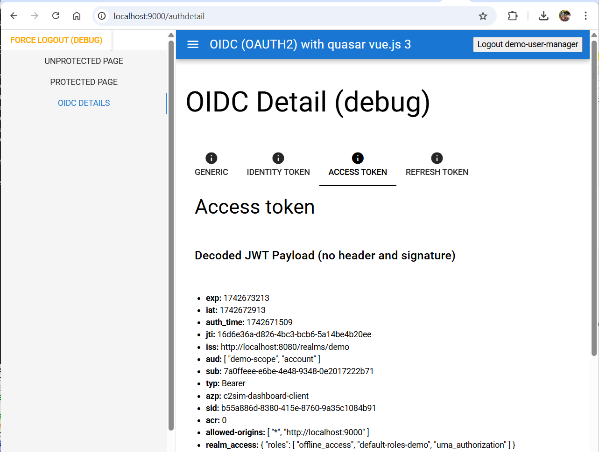

# Vue 3 OIDC (OAUTH) demo

This project demonstrates how to use OIDC in a Vue.js 3 application.

## Libraries / frameworks

- [Quasar](https://quasar.dev/) - UI Library (can be any UI framework)

- [Pinia](https://pinia.vuejs.org/) - State management

- [oidc-client-ts](https://github.com/authts/oidc-client-ts) - Typescript library for OIDC

- [jwt-decode](https://www.npmjs.com/package/jwt-decode) - View JWT content payload (optional)

## Prerequisites

- [Node.js](https://nodejs.org/en/download) - Build system

- [Podman](https://podman.io/) - to deploy docker images (or docker desktop)

- [pnpm](https://pnpm.io/installation) - Package dependencies (npm will also work)

## Identity Provider

For the demo the IDP [keycloak](http://keycloak.org) is used. Keycloak is deployed in a docker container and configured trough scripts.

Under windows:

```
StartKeycloakServer.bat
```

This will start the Keycloak server on port 8080. Open an web browser with `http://localhost:8080`

- Login as `admin` with password `adminpwd`

- Switch from `master` realm to `demo` realm

- Create two users:
  
  - User `demo-user-manager` with password `demo-user-manager` and join to group `demo-group-manager`
  
  - User `demo-user-admin` with password `demo-user-admin` and join group `demo-group-admin'

## Build web application

```
pnpm install # Download dependencies
pnpm run dev # Start webserver on port 9000
```

## Test application

- Open web browser on '[http://localhost:9000'](http://localhost:9000')

- Login with created used credentials


